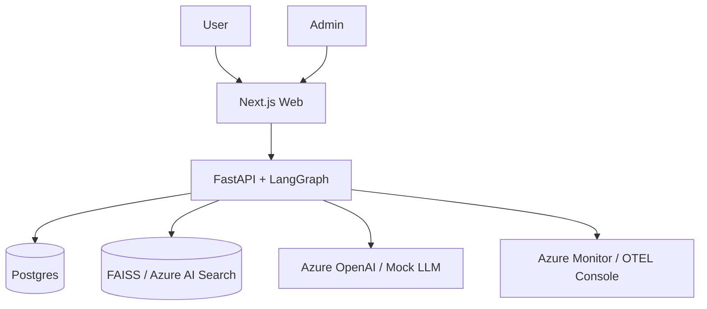
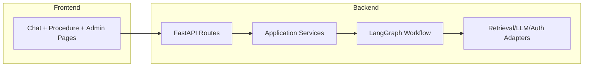
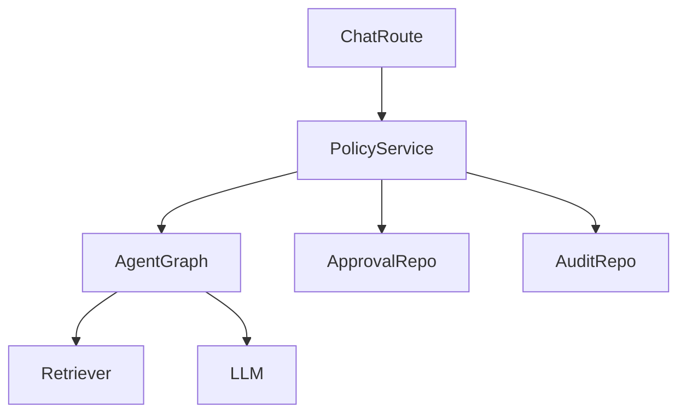
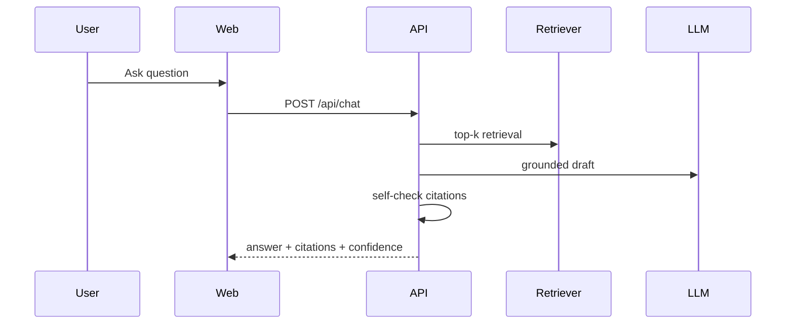
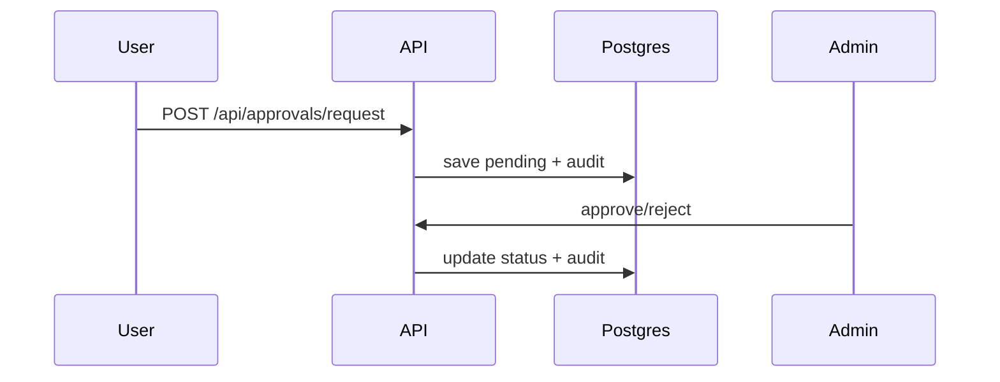

# Architecture

## C4 Context

```mermaid
graph TD
  User-->Web[Next.js Web]
  Admin-->Web
  Web-->API[FastAPI + LangGraph]
  API-->PG[(Postgres)]
  API-->Vec[(FAISS / Azure AI Search)]
  API-->LLM[Azure OpenAI / Mock LLM]
  API-->Mon[Azure Monitor / OTEL Console]
```

## C4 Container

```mermaid
graph LR
  subgraph Frontend
    UI[Chat + Procedure + Admin Pages]
  end
  subgraph Backend
    Routes[FastAPI Routes]
    AppSvc[Application Services]
    Graph[LangGraph Workflow]
    Infra[Retrieval/LLM/Auth Adapters]
  end
  UI-->Routes-->AppSvc-->Graph-->Infra
```

## Components

```mermaid
graph TD
  ChatRoute-->PolicyService
  PolicyService-->AgentGraph
  AgentGraph-->Retriever
  AgentGraph-->LLM
  PolicyService-->ApprovalRepo
  PolicyService-->AuditRepo
```

## Sequence: Ask Policy

```mermaid
sequenceDiagram
  participant U as User
  participant W as Web
  participant A as API
  participant R as Retriever
  participant L as LLM
  U->>W: Ask question
  W->>A: POST /api/chat
  A->>R: top-k retrieval
  A->>L: grounded draft
  A->>A: self-check citations
  A-->>W: answer + citations + confidence
```

## Sequence: Approval

```mermaid
sequenceDiagram
  participant U as User
  participant A as API
  participant DB as Postgres
  participant AD as Admin
  U->>A: POST /api/approvals/request
  A->>DB: save pending + audit
  AD->>A: approve/reject
  A->>DB: update status + audit
```
